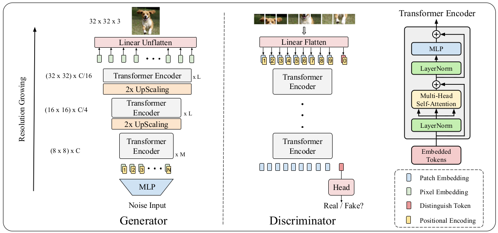

# CS5260-Project, group TO-GLAM: Transformers Only GAN with Layerwise Masking

## Authors: 
	- Louth Bin Rawshan (A0219290E)
	- Ren Ruiqiang (A0218966M)
	- Lim Jia Xian, Clarence (A0212209U)
	- Tran Khanh Hung (A0212253W)


Code used for [TransGAN: Two Transformers Can Make One Strong GAN](https://arxiv.org/abs/2102.07074). 

## Related work:
Our code is inspired from research paper TransGAN: Two Transformers Can Make One Strong GAN ([Github code](https://github.com/VITA-Group/TransGAN))

## Main Pipeline


## Self-attention mask


## Layer masking type

### Temporal masking


### Square masking


### Row masking


### Random masking


## Check points were trained in experiments

([Google Drive](https://drive.google.com/drive/folders/10nl0DKjPIT9Ze1GF67uD0yccxFHFzNM9?usp=sharing))

## Environment setup
```bash
pip install -r requirements.txt
```
Notice: Python version = 3.6

## Training
```bash
# cifar-10
sh exps/cifar10_train.sh

# stl-10
sh exps/stl10_train.sh

* Notice: 
	--gen_model TransGAN_8_8_1 : train baseline model on cifar10 dataset

	--gen_model TransGAN_8_8_1_layermask : train layer masking model on cifar10 dataset
	
	--gen_model TransGAN_8_8_G2_1 : train baseline model on stl10 dataset

	--gen_model TransGAN_8_8_G2_1_layermask : train layer masking model on stl10 dataset
		
	--mask 4_8 : set mask size 4 and 8 for layer 2 and layer 3 of layer masking models respectively. The mask size can be set to 8_4 (big to small masking) , 4_8 (small to big masking), 8_8(same size masking)
	
	--mask_type 0 : set masking type. Whereby, 0 indicates square masking, 1 indicates row-wise masking, 2 indicates random masking
```
## Testing
Firstly download the checkpoints
```bash
# cifar-10
sh exps/cifar10_test.sh

# stl-10
sh exps/stl10_test.sh

```

## Acknowledgement
Codebase from [TransGAN](https://github.com/VITA-Group/TransGAN)

## Citation
```
@article{jiang2021transgan,
  title={TransGAN: Two Transformers Can Make One Strong GAN},
  author={Jiang, Yifan and Chang, Shiyu and Wang, Zhangyang},
  journal={arXiv preprint arXiv:2102.07074},
  year={2021}
}
```
